<div id="top"></div>
<!-- 项目 LOGO -->
<br />
<div align="center">
  <!-- <a href="https://github.com/othneildrew/Best-README-Template">
    
  </a> -->
  <h1 align="left">小鹿AI智能数据平台</h1>

</div>

<!-- 目录 -->
<details>
  <summary>目录</summary>
  <ol>
    <li>
      <a href="#项目介绍">项目介绍</a>
      </li>
    <li>
      <a href="#项目架构">项目架构</a>
      <ul>
        <li><a href="#前端">前端</a></li>
        <li><a href="#后端">后端</a></li>
        <li><a href="#数据库">数据库</a></li>
      </ul>
    </li>
    <li>
      <a href="#项目功能">项目功能</a>
      <ul>
        <li><a href="#用户管理">用户管理</a></li>
        <li><a href="#数据管理">数据管理</a></li>
        <li><a href="#数据分析">数据分析</a></li>
        <li><a href="#数据生成">数据生成</a></li>
        <li><a href="#数据处理">数据处理</a></li>
      </ul>
    </li>
    <li><a href="#环境搭建">环境搭建</a></li>
    <li><a href="#Future">Future</a></li>
  </ol>
</details>

<!-- 关于本项目 -->
## 项目介绍


小鹿AI智能数据平台是为深度学习和大模型开发同学提供数据的**全生命周期管理的平台**。它提供从数据生成，数据存储与读取，数据分析，数据处理的功能。

该项目的目标是为了使每个同学能够从大模型开发中纷繁的数据构造，存储，分析，异常检测等过程中解放出来。提升数据的利用率，生成效率，降低分析成本，管理成本。让同学们可以更专注于业务本身，将大模型开发流程变成**流水线**。

## Features
- **数据管理**--支持单文件**10w**数据量的数据集的上传，下载，删除。支持数据格式xlsx,json,jsonl和csv的互相转换。

- **数据生成**--支持调用自定义LLM模型API对数据进行批量处理，单次生成服务支持最大数据量**10W**条，支持断点续连，生成数据存储，支持2中数据生成方式，支持自定义模板，支持生成数据的下载和保存。支持**大数据生成存储**，提供用户友好性的**断点续连**方式进行数据生成，提供**容错生成**。

- **数据分析**--支持对数据集的质量进行智能分析。提供数据集一键分析功能，提供用户友好性的数据集分数。提供多维度数据质量分析：频率，长度，缺失值，聚类，重复等细节分布特征查看。

## Changelog
- [24/6/5] 实现10W条数据生成功能，数据生成模块的**大数据**数据上传，存储，展示和下载。实现**断点续连**功能，实现**容错生成**。实现生成时**数据增量传递与显示**，实现**prompt和response对**的存储和显示。添加生成**进度条的时间显示**。

## 项目架构
项目以前端，后端和数据库分离的架构设计的。其中前端以Gradio实现为主，后端使用FastAPI构建，数据库使用MangoDB实现。各个模块间采用规定的数据结构进行交互。

### 前端
前端采用Gradio库来实现。为了增加框架的稳定性和可扩展性，实现了Manager类，其是一个单例，以树的形式管理前端中的所有组件，方便用户进行扩展，删除和使用各个组件。

### 后端
后端采用了FastAPI库来实现，提供了各种功能的Web API支持。核心组件包括数据库操作，日志系统，用户管理系统，运行状态系统，和各个模块的核心功能组件。各个模块的实现采用独立的文件组织架构，方便后期进行功能扩展和系统维护。

### 数据库
数据库采用MangoDB进行构建，前后端与之分别展开交互。
后端通过与数据库的交互，实现在程序运行期间的数据及状态的存储、读取、更新和删除等操作；
数据库实现了用户空间，数据空间和任务状态空间的数据结构，支持平台的各个核心功能模块。
前端通过与数据库的交互，除了数据的读取、查看和删除，还能够监测用户状态和程序状态，将反馈信息直观地展示在前端页面上，为用户提供指引。
> 数据存储系统设计了大数据存储功能，支持存储100k数据量左右的sft数据

#### 数据库结构
数据库存储采用树的形式，不同用户的数据作为分支存储在集合XRDF-stable下；按照不同Tabel页，不同Tabel页下的数据又作为分支存储在用户下：

| collection              | 说明                                    |
|------------------|---------------------------------------|
| init             | 用于存储用户登录状态和功能页状态                      |
| dataset_info     | 存储Data Manager功能页上传的文档和回归测试的结果        |
| generation       | 存储Data Generation功能页上传的文档和生成的结果       |
| large_data_merge | 存储Data Manager功能页上传的较大文档内容，根据name字段区分 |

<p align="right">(<a href="#top">返回顶部</a>)</p>

## 项目功能
### 用户管理
`Top`含有项目信息、登入登出、日志查看三部分。

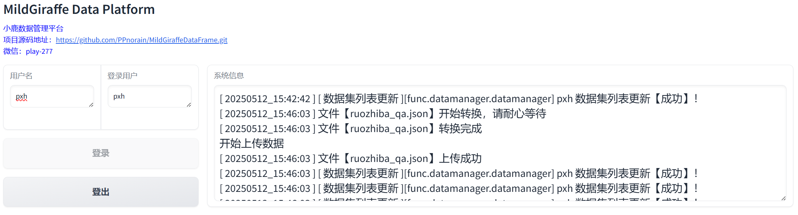  

<p align="right">(<a href="#top">返回顶部</a>)</p>

### 数据管理
`Data Manager`下包含`查看/删除数据集`、`搜索数据集`、`上传数据集`、`下载数据集`4个子功能，目前支持xlsx、csv、json和jsonl四种数据的上传，系统会自动解析为多个样本存储到`user.dataset_info`中，同时支持将数据转换为以上4种格式文件并下载。 
 
 `数据集上传下载`接口界面
 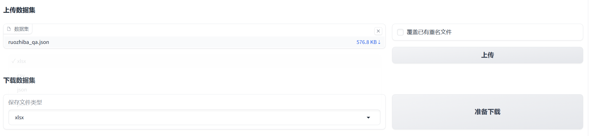 
`数据集数据统计与显示界面`
 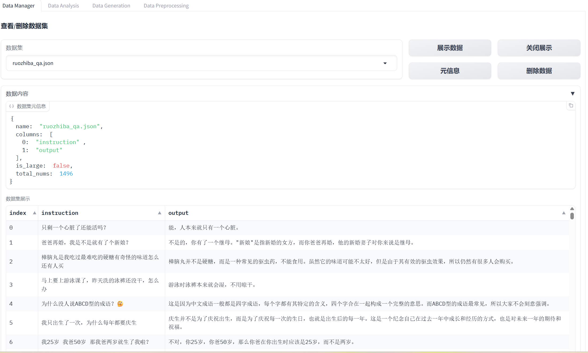 

`数据管理模块演示`

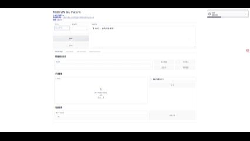 

<p align="right">(<a href="#top">返回顶部</a>)</p>

### 数据分析

`Data Analysis`为用户提供全方位的数据分析功能。包括从系统性的数据统计信息分析到单维度的数据特征分析，再到数据搜索。从数据到数值统计特征到可视化图表信息。该模块提供了用户多维度的丰富的数据分析功能，能够尽可能的满足用户的多样化数据分析需求。

`Data Analysis`由三个模块组成：`数据健康分析`,`数据细节信息分析`和`数据搜索功能`。用户可以从三个数据源选择数据进行分析，分别是`dataset_info`，`generation`和`processing`，代表用户上传的数据集，平台智能生成的数据集和平台数据处理的数据集。

---

**一键健康分析**

为用户提供了最简单的分析和结果可视化显示，用于帮助用户快速了解数据概括。其提供了6个维度的数据健康指标：长度分析，缺失率，特殊字符，重复率，列冗余和N-gram重复值分析。

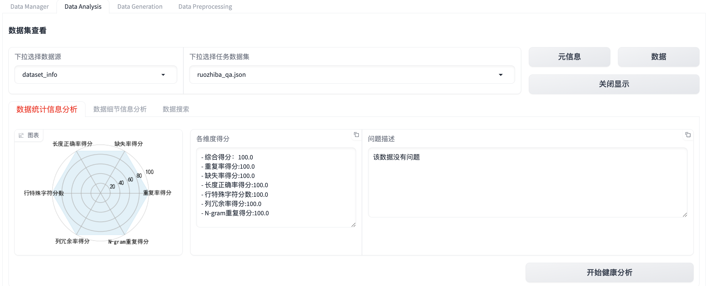

**数据细节信息分析**

为用户提供了4个维度的数据特征分析。包括：数据分布，长度分布，聚类分布和重复与缺失值。提供了灵活的行列可选项，用户可以按照自己的需求来选择对应的数据进行详细分析。并且所有分析都可以进行可视化，以便用户可以直观快速的分析数据，找出数据中存在的问题。

1. 数据分类分析与可视化

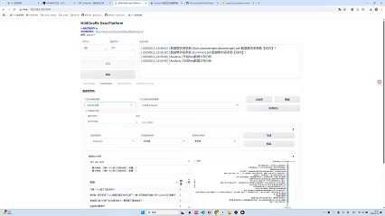

2. 数据长度分析与可视化

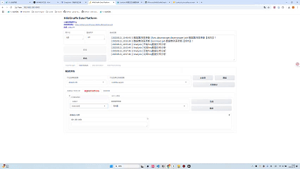
  
3. 数据聚类分析与可视化

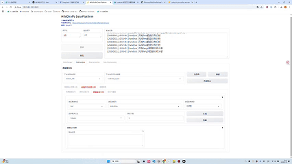

4. 重复值与缺失值查看

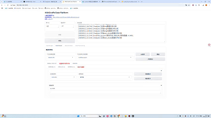

<p align="right">(<a href="#top">返回顶部</a>)</p>

---
**数据搜索**

搜索功能提供了4大类14小类搜索算法。丰富的搜索算法保证了从模糊搜索到精确搜索到需求都可以得到满足。通过搜索功能可以帮助用户找到数据的问题，了解每一条数据。

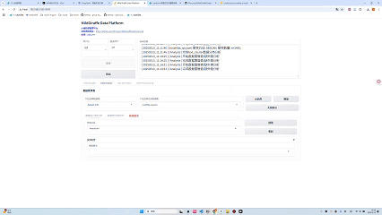

### 数据生成  
`Data Generation` 的功能为基于大模型和prompt生成数据。其中`模板`作为prompt，`种子文件`作为input，二者组合，输入到LLM中进行数据生成。该平台支持数据，模版和LLM进行解耦的形式，每个部分都有其单独的数据空间。因此可以灵活的存储相应内容。
`Data Generation`下的组件分为 `生成数据管理`、`生成配置`和`生成操作`三个部分。 

1. 生成配置  
    - 方法选择:当前框架集成了2种生成方法。  
        > 其中`FewShotGenerator`为少样本数据生成，可进行数据扩充。prompt拼接时需要从`种子文件`中采样，之后根据生成数的设置来生成相应数量的数据。  
        > `BatchGenerator`方法用于数据生成，其prompt拼接方式为`模板`拼接`种子文件`中的某一条数据，生成数量与`种子文件`中的样本数量与设置的生成数中取小值。   

    - 模板与种子文件管理：  
    ![]

    - 预览种子文件：  
选择种子文件，点击预览，可查看模板内容：  
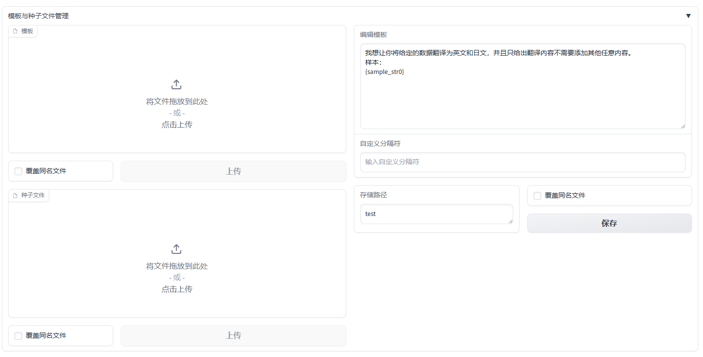  

2. prompt组装及预览  
    - FewShotGenerator
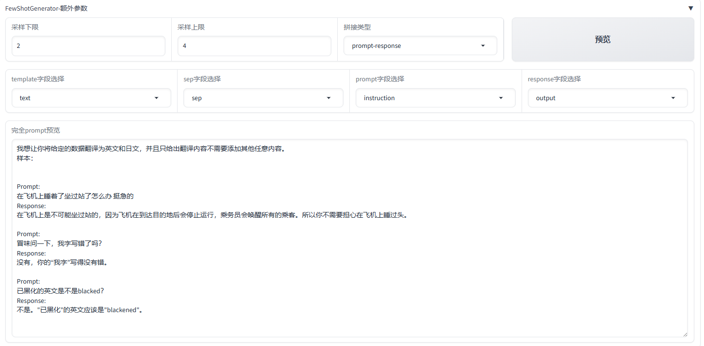  
    - 参数说明： 
        | FewShotGenerator-额外参数 | 说明
        |-------|-----|
        | 采样下限   | 最小采样数量|
        | 采样上限   | 最大采样数量|
        | 拼接类型   | 只使用prompt、只使用response、prompt+response|
        | template字段选择 | 模板文件中的模板字段|
        | sep字段选择 | 模板文件中的分隔符字段|
        | prompt字段选择 | 种子文件中的prompt字段|
        | response字段选择 | 种子文件中的response字段|

    - BatchGenerator  
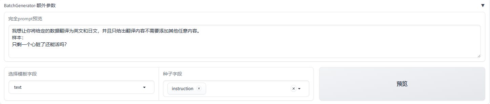  

3. LLM配置定义  

LLM支持三种类型的API访问方式，openai，azure和request方式。对于支持类OpenAI的API都可以轻松被数据平台所访问。配置支持API密钥，API地址填写，服务名填写。

除了访问API常用参数外，还支持多线程线程数设置，访问时间间隔设置。温度和top-p生成参数设置。
对于配置好的API，可以设置一个API配置名，点击保存配置，将其保存到API数据库中。下一次只需要在`模型配置选择`中找到上次的配置名即可。

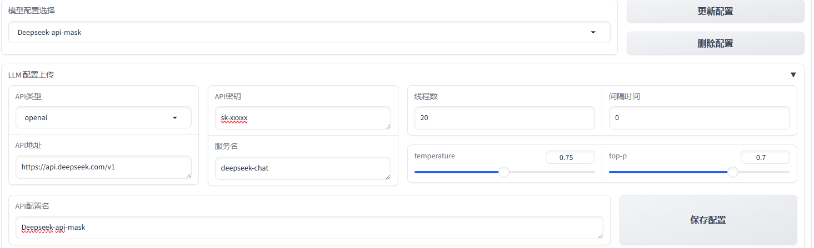  

4. 数据生成  

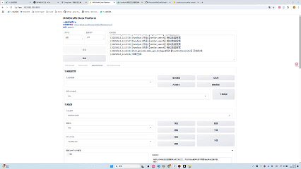  


5. 生成数据管理  
生成完成的数据将保存在数据库collection`user.generation`中，可在上方`生成数据管理`处进行管理（同`Data Manger`页）

<p align="right">(<a href="#top">返回顶部</a>)</p>

### 数据处理
`Data Preprocess`下集成了数据预处理的功能。目前集成了常用的文件级别和字段级别的数据处理方法。共16种。

数据处理完毕后，处理后的数据集会存储到对应processing数据源中。同样处理后的数据也可以被下载使用。

   

<p align="right">(<a href="#top">返回顶部</a>)</p>

## Future
项目目前处于测试阶段，还有很多功能和需求需要开发。
- [ ] 数据集搜索算法：字段搜索，语义搜索等
- [ ] 数据集分析：聚类分析，语义分析，统计分析等
- [ ] 数据生成功能的扩展
- [ ] 数据处理功能的扩展
- [ ] 平台易用性的进一步优化


## 环境搭建
### 依赖库安装

项目提供了环境一键构建脚本，该脚本使用了先进的uv库管理系统。进入env目录运行`sh build_en.sh`就会自动在当前环境中安装客户端和服务器所需要的库。

### 服务端数据库安装

由于服务端实现了数据库后端，其有MongDB数据库支持。因此要正确运行后端，需要搭建一个MongDB数据库服务。 建议使用docker安装。
```
docker pull mongo:latest
docker run -d \
  --name mongodb \
  -p 17017:27017 \
  -v /nas/mongodb_data:/data/db \
  -e MONGO_INITDB_ROOT_USERNAME=admin \
  -e MONGO_INITDB_ROOT_PASSWORD=123 \
  mongo:latest --auth
```

### 服务端配置与运行

要正确运行服务端，需要设置服务端的mongodb接口。在文件`src/server/dependencies.py`中设置
```
client = MongoClient('mongodb://user:passwd@ip:port/')
```
即可。
服务端的ip与端口在`src/server/ MGDF_server.py`文件中
```
uvicorn.run("MGDF_server:app", host="0.0.0.0", port=19008, reload=True, workers=4)
```
语句进行修改即可。
然后进入目录`src/server/`,运行命令
```
python3 MGDF_server.py
```

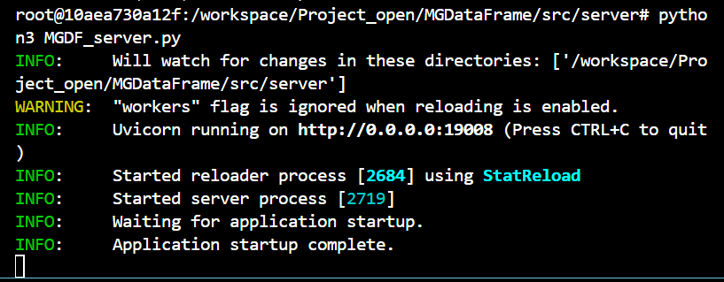

### 客户端配置与运行

要正确运行客户端，需要在客户端设置其使用的服务端的ip。
在`src/client/conf/userconf.py`中设置`URL="http://127.0.0.1:19008/"`为你服务端的ip与端口。
在文件`src/client/MGDF_client.py`语句  
```
demo.launch(server_name="0.0.0.0", server_port=8000, share=False, inbrowser=True, show_error=True, max_threads=100, favicon_path='../../reference/images/giraffe.svg')
```
可以设置客户端的端口和ip。
最后运行
```
python3 MGDF_client.py
```
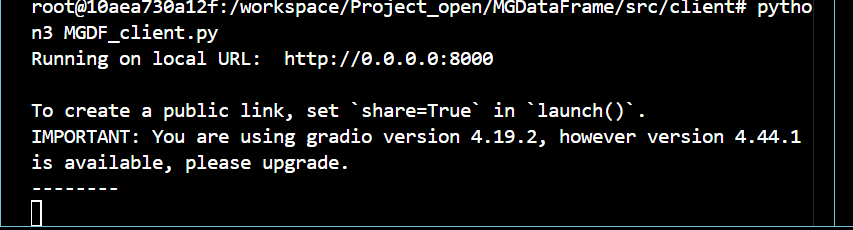